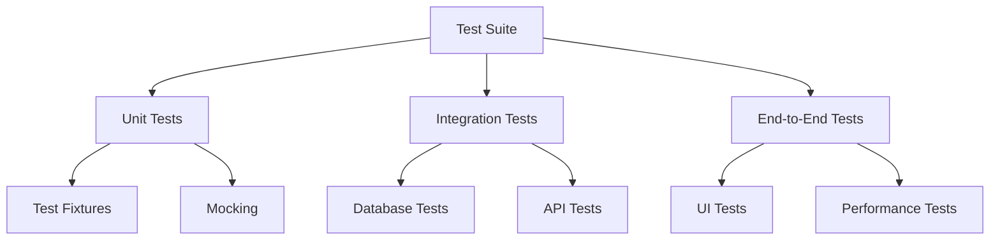
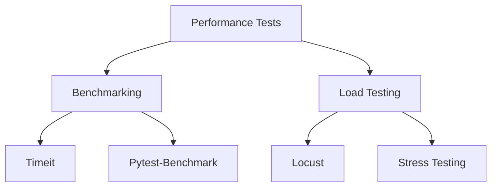

# Testing Guide

## Overview

This guide provides comprehensive information about testing in MyJobSpyAI, including unit tests, integration tests, and end-to-end testing.

## Testing Structure



## Unit Tests

### Test Organization

```python
# Example test organization
from unittest import TestCase
from myjobspyai.analysis import JobAnalyzer

class TestJobAnalyzer(TestCase):
    def setUp(self):
        self.analyzer = JobAnalyzer()
        
    def test_skill_extraction(self):
        """Test skill extraction from job descriptions"""
        description = "Senior Python Developer with 5+ years experience"
        skills = self.analyzer.extract_skills(description)
        self.assertIn("Python", skills)
        self.assertIn("Developer", skills)
        
    def test_salary_estimation(self):
        """Test salary range estimation"""
        description = "Senior Software Engineer in Silicon Valley"
        salary_range = self.analyzer.estimate_salary(description)
        self.assertGreater(salary_range[0], 100000)
```

### Best Practices

- Write focused, isolated tests
- Use descriptive test names
- Keep tests independent
- Mock external dependencies
- Test edge cases
- Include assertions

## Integration Tests

```python
# Example integration test
import pytest
from myjobspyai.scrapers import LinkedInScraper

@pytest.fixture
async def linkedin_scraper():
    scraper = LinkedInScraper()
    yield scraper
    await scraper.close()

@pytest.mark.asyncio
async def test_job_scraping(linkedin_scraper):
    """Test LinkedIn job scraping"""
    jobs = await linkedin_scraper.scrape("Software Engineer", "San Francisco")
    assert len(jobs) > 0
    assert all(job.title and job.company for job in jobs)
```

## Performance Testing



### Example Performance Test

```python
import timeit
from myjobspyai.analysis import JobAnalyzer

def test_performance():
    """Test analysis performance"""
    analyzer = JobAnalyzer()
    description = """Senior Python Developer required for AI startup. 
    Must have experience with machine learning and cloud services."""
    
    # Measure analysis time
    start_time = timeit.default_timer()
    results = analyzer.analyze(description)
    elapsed = timeit.default_timer() - start_time
    
    assert elapsed < 1.0  # Should complete in less than 1 second
```

## Testing Tips

=== "Python"
    ```python
    # Use pytest fixtures for setup/teardown
    @pytest.fixture
    def test_data():
        return {
            "description": "Senior Developer",
            "skills": ["Python", "Django"]
        }
    ```

=== "JavaScript"
    ```javascript
    // Use Jest for testing
    describe('JobAnalyzer', () => {
        test('should extract skills', () => {
            const analyzer = new JobAnalyzer();
            const skills = analyzer.extractSkills('Senior Python Developer');
            expect(skills).toContain('Python');
        });
    });
    ```

## Common Test Patterns

### Parametrized Tests

```python
@pytest.mark.parametrize(
    "description,expected_skills",
    [
        ("Python Developer", ["Python", "Developer"]),
        ("Data Scientist", ["Data", "Science"]),
        ("DevOps Engineer", ["DevOps", "Engineering"])])
async def test_skill_extraction(description, expected_skills):
    analyzer = JobAnalyzer()
    skills = analyzer.extract_skills(description)
    assert all(skill in skills for skill in expected_skills)
```

### Test Fixtures

```python
@pytest.fixture
async def test_job():
    """Create a test job instance"""
    job = Job(
        title="Software Engineer",
        company="TechCo",
        location="San Francisco",
        description="Senior software engineer position"
    )
    yield job
```

## Troubleshooting

!!! warning "Common Issues"
    - Slow test execution: Use mocking and fixtures
    - Test failures: Check dependencies and data
    - Memory leaks: Use proper cleanup
    - Race conditions: Use async/await properly

!!! tip "Best Practices"
    - Write tests before code (TDD)
    - Keep tests small and focused
    - Use descriptive test names
    - Include setup/teardown
    - Mock external services
    - Test edge cases
    - Use fixtures for setup
    - Include assertions
