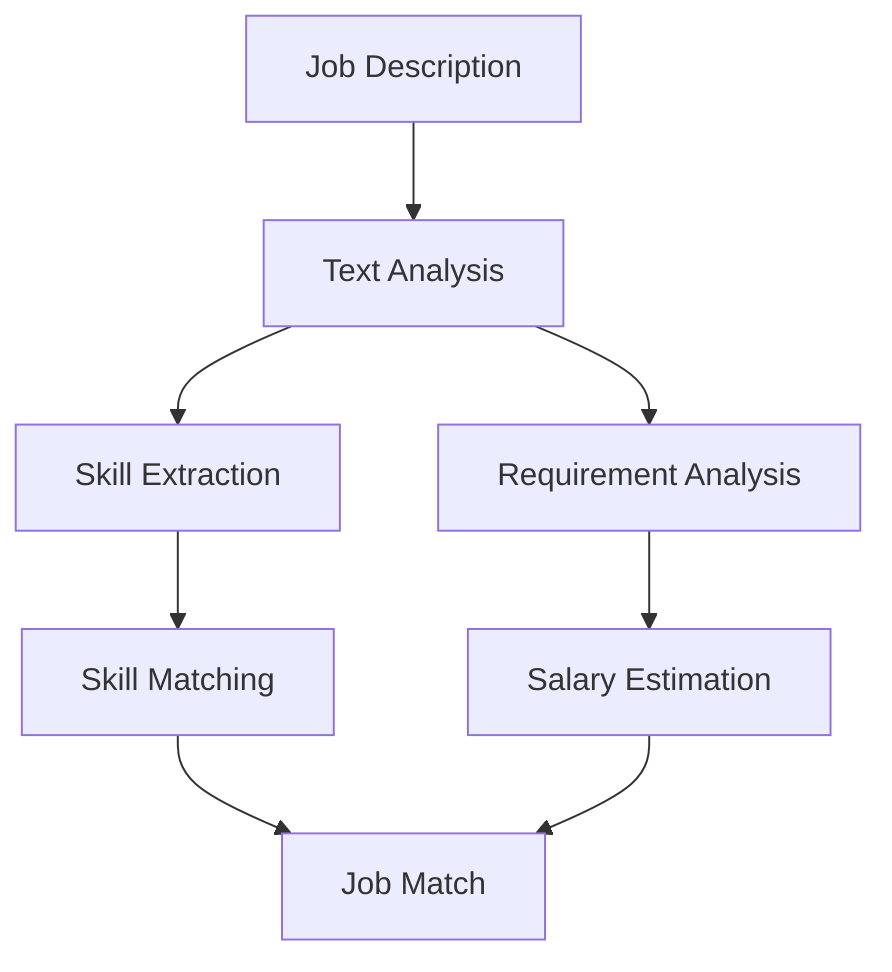

# Feature Examples

## Code Examples

```python
# Example of using the job analysis feature
def analyze_job(job_description: str) -> dict:
    """
    Analyze a job description using MyJobSpyAI
    
    Args:
        job_description: The job description text
        
    Returns:
        dict: Analysis results including skills, requirements, and salary range
    """
    analyzer = JobAnalyzer()
    results = analyzer.analyze(job_description)
    return results
```

## Mermaid Diagrams



## Tabbed Content

=== "Python"
    ```python
    from myjobspyai.analysis import JobAnalyzer
    analyzer = JobAnalyzer()
    results = analyzer.analyze(job_description)
    ```

=== "JavaScript"
    ```javascript
    const results = analyzer.analyze(jobDescription);
    ```

## Task Lists

- [x] Basic job analysis
- [x] Skill extraction
- [ ] Advanced filtering
- [ ] Salary prediction

## Progress Bars

:bar:`50` Completed 50% of the job analysis features

## Admonitions

!!! note
    This is a note about using the job analysis feature

!!! warning
    Make sure to validate job descriptions before analysis

## Code with Line Numbers

```python linenums="1"
def analyze_resume(resume_text: str) -> dict:
    """
    Analyze a resume using MyJobSpyAI
    
    Args:
        resume_text: The resume text
        
    Returns:
        dict: Analysis results including skills, experience, and education
    """
    analyzer = ResumeAnalyzer()
    results = analyzer.analyze(resume_text)
    return results
```
